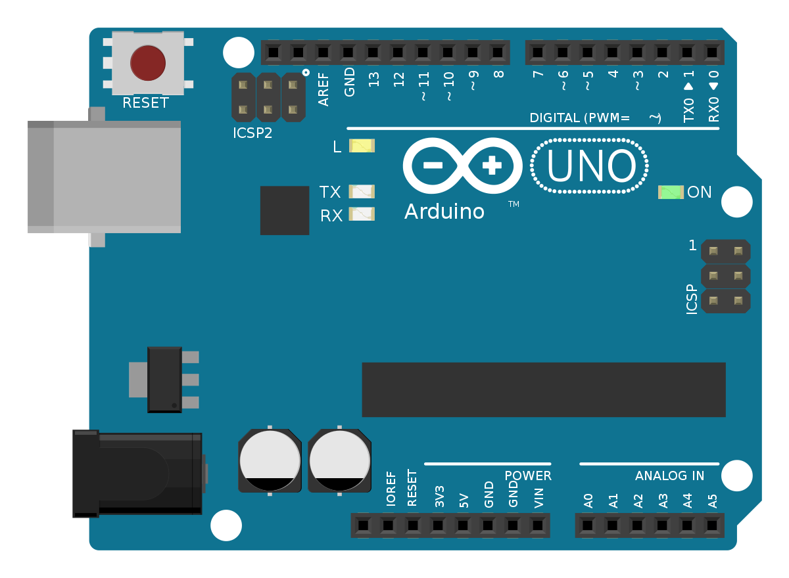
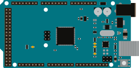
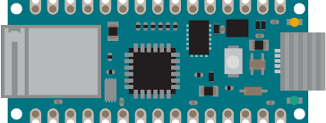
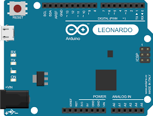
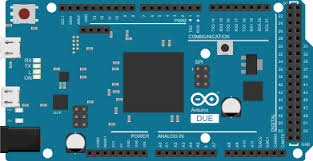
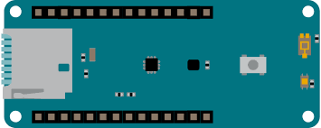

# Spletni učbenik: Arduino

## 1. Uvod v Arduino in IoT
### 1.1 Kaj je Arduino
Arduino je odprtokodna platforma, ki omogoča enostaven razvoj elektronskih projektov. Sestavlja jo programska (Arduino IDE) in strojna oprema (različne razvojne plošče). Glavna prednost Arduina je njegova preprostost, cenovna dostopnost in velika skupnost uporabnikov, ki omogoča hitro učenje in razvoj.

Arduino temelji na mikrokontrolerjih podjetja Atmel (npr. ATmega328) in omogoča interakcijo z različnimi senzorji, aktuatorji in komunikacijskimi moduli. Z Arduinom lahko nadzorujemo osvetlitev, motorje, temperaturo in druge elektronske komponente, zaradi česar je zelo priljubljen v projektih pametnega doma, robotike in interneta stvari (IoT).

#### Primeri Arduino plošč:
- **Arduino Uno** – Najbolj priljubljena razvojna plošča, temelji na ATmega328P, ima 14 digitalnih vhodno/izhodnih pinov, 6 analognih vhodov in USB povezavo.

- **Arduino Mega** – Zmogljivejša različica z več vhodi in izhodi, primerna za kompleksne projekte.

- **Arduino IoT** – Razvojna plošča, posebej zasnovana za internet stvari (IoT).
Vsebuje integrirano WiFi ali Bluetooth povezljivost ter podporo za varno povezovanje z oblačnimi storitvami.
Idealen za projekte, ki zahtevajo oddaljeni dostop in obdelavo podatkov v realnem času.

- **Arduino Leonardo** – Ima integriran USB, kar omogoča simulacijo tipkovnice ali miške.
  

- **Arduino Due** – Temelji na 32-bitnem ARM procesorju, primeren za naprednejše projekte.
  

- **Arduino MKR serija** – Plošče z integrirano WiFi/Bluetooth povezljivostjo, namenjene IoT aplikacijam.

### 1.2 Osnovne komponente Arduino sistema
### 1.3 Kaj je IoT in kako se povezuje z Arduinom?
### 1.4 Priprava razvojnega okolja (Arduino IDE, knjižnice)

## 2. Osnove programiranja v Arduinu
### 2.1 Struktura programa (setup in loop)
### 2.2 Izpis na serijsko konzolo
### 2.3 Spremenljivke in podatkovni tipi
### 2.4 Osnovne operacije in izrazi

## 3. Nadzor vhodov in izhodov
### 3.1 Digitalni vhodi in izhodi (LED, gumbi)
### 3.2 Analogni vhodi in izhodi (senzorji, PWM)
### 3.3 Branje in zapis podatkov

## 4. Krmilne strukture v Arduino
### 4.1 Pogojni stavki (if, else)
### 4.2 Zanke (for, while, do-while)
### 4.3 Funkcije in modulacija kode

## 5. Obdelava podatkov in prikaz rezultatov
### 5.1 Osnovna obdelava podatkov (matematične operacije)
### 5.2 Pretvarjanje podatkovnih tipov
### 5.3 Shranjevanje podatkov (EEPROM, SD kartica)
### 5.4 Prikaz podatkov na LCD in OLED zaslonih

## 6. Senzorji in aktuatorji
### 6.1 Delo s temperaturnimi in vlažnostnimi senzorji
### 6.2 Uporaba ultrazvočnih senzorjev za merjenje razdalje
### 6.3 Servo motorji in motorni pogoni

## 7. Komunikacija z drugimi napravami
### 7.1 Serijska komunikacija (UART)
### 7.2 I2C in SPI protokoli
### 7.3 Pošiljanje podatkov med Arduinom in računalnikom

## 8. Povezovanje Arduina z internetom
### 8.1 Uporaba WiFi in Ethernet modulov (ESP8266, ESP32)
### 8.2 HTTP zahteve in uporaba API-jev
### 8.3 MQTT protokol za IoT projekte

## 9. Mobilne aplikacije in Arduino
### 9.1 Povezava Arduina s pametnimi telefoni (Bluetooth, WiFi)
### 9.2 Pošiljanje podatkov v oblak (Google Firebase, ThingSpeak)
### 9.3 Upravljanje Arduina preko mobilne aplikacije

## 10. Napredne IoT rešitve in projekti
### 10.1 Pametni dom (nadzor luči, temperature, varnosti)
### 10.2 IoT vremenska postaja
### 10.3 Oddaljeno upravljanje naprav prek spleta

## 11. Optimizacija in varnost v IoT
### 11.1 Varčevanje z energijo (sleep mode)
### 11.2 Osnove kibernetske varnosti v IoT napravah
### 11.3 Šifriranje podatkov in zaščita komunikacije

## 12. TEST

$A =$ ,  
$f =$ ,  
$ϕ =$ 

## 13. TEST2

## Discrete Closed-Loop Control System with PID  
$$ G(z) = \frac{b_0 + b_1 z^{-1} + b_2 z^{-2}}{1 + a_1 z^{-1} + a_2 z^{-2}} $$  
$b_0 =$ ,  
$b_1 =$ ,  
$b_2 =$ ,  
$a_1 =$ ,  
$a_2 =$    
$K_p =$ ,  
$K_i =$ ,  
$K_d =$    
<select output="signalType"><option value="step">Step</option><option value="ramp">Ramp</option><option value="sin">Sine</option></select>  
  
  
