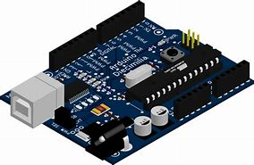

# Spletni učbenik: Arduino

## 1. Uvod v Arduino in IoT
### 1.1 Kaj je Arduino
### 1.2 Osnovne komponente Arduino sistema
### 1.3 Kaj je IoT in kako se povezuje z Arduinom?
### 1.4 Priprava razvojnega okolja (Arduino IDE, knjižnice)

## 2. Osnove programiranja v Arduinu
### 2.1 Struktura programa (setup in loop)
### 2.2 Izpis na serijsko konzolo
### 2.3 Spremenljivke in podatkovni tipi
### 2.4 Osnovne operacije in izrazi

## 3. Nadzor vhodov in izhodov
### 3.1 Digitalni vhodi in izhodi (LED, gumbi)
### 3.2 Analogni vhodi in izhodi (senzorji, PWM)
### 3.3 Branje in zapis podatkov

## 4. Krmilne strukture v Arduino
### 4.1 Pogojni stavki (if, else)
### 4.2 Zanke (for, while, do-while)
### 4.3 Funkcije in modulacija kode

## 5. Obdelava podatkov in prikaz rezultatov
### 5.1 Osnovna obdelava podatkov (matematične operacije)
### 5.2 Pretvarjanje podatkovnih tipov
### 5.3 Shranjevanje podatkov (EEPROM, SD kartica)
### 5.4 Prikaz podatkov na LCD in OLED zaslonih

## 6. Senzorji in aktuatorji
### 6.1 Delo s temperaturnimi in vlažnostnimi senzorji
### 6.2 Uporaba ultrazvočnih senzorjev za merjenje razdalje
### 6.3 Servo motorji in motorni pogoni

## 7. Komunikacija z drugimi napravami
### 7.1 Serijska komunikacija (UART)
### 7.2 I2C in SPI protokoli
### 7.3 Pošiljanje podatkov med Arduinom in računalnikom

## 8. Povezovanje Arduina z internetom
### 8.1 Uporaba WiFi in Ethernet modulov (ESP8266, ESP32)
### 8.2 HTTP zahteve in uporaba API-jev
### 8.3 MQTT protokol za IoT projekte

## 9. Mobilne aplikacije in Arduino
### 9.1 Povezava Arduina s pametnimi telefoni (Bluetooth, WiFi)
### 9.2 Pošiljanje podatkov v oblak (Google Firebase, ThingSpeak)
### 9.3 Upravljanje Arduina preko mobilne aplikacije

## 10. Napredne IoT rešitve in projekti
### 10.1 Pametni dom (nadzor luči, temperature, varnosti)
### 10.2 IoT vremenska postaja
### 10.3 Oddaljeno upravljanje naprav prek spleta

## 11. Optimizacija in varnost v IoT
### 11.1 Varčevanje z energijo (sleep mode)
### 11.2 Osnove kibernetske varnosti v IoT napravah
### 11.3 Šifriranje podatkov in zaščita komunikacije
